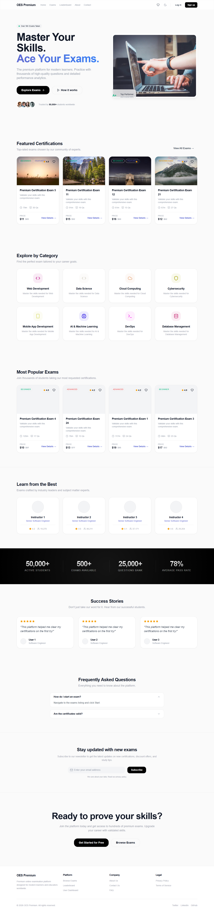
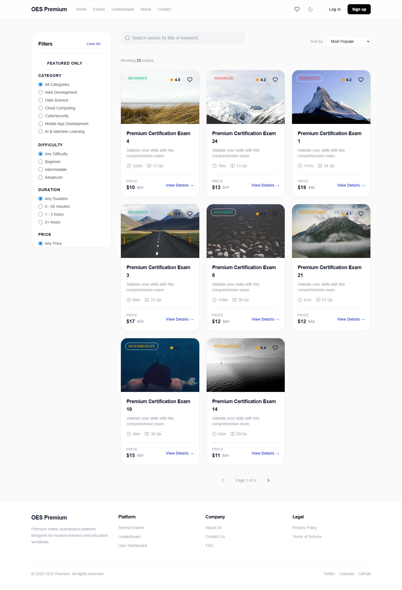
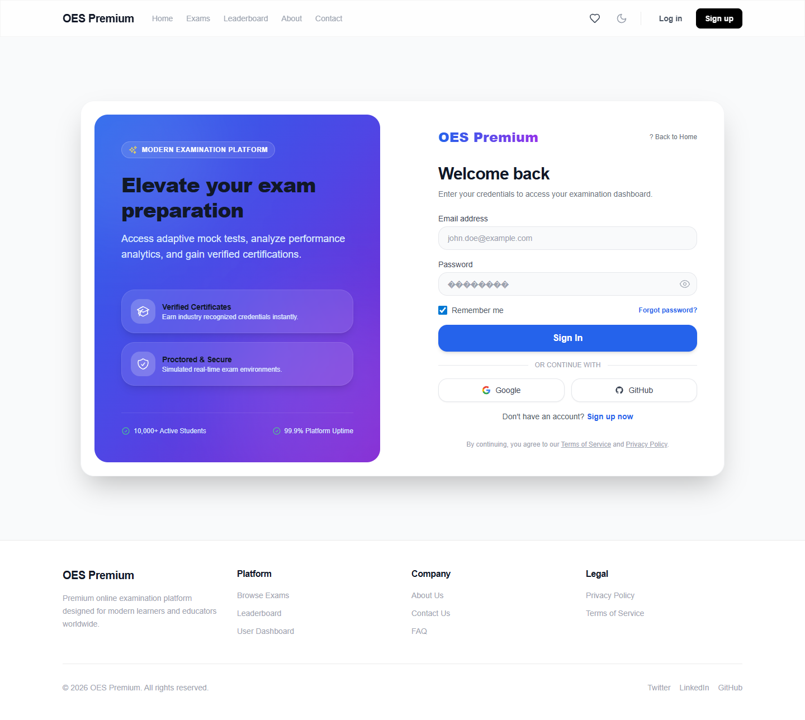
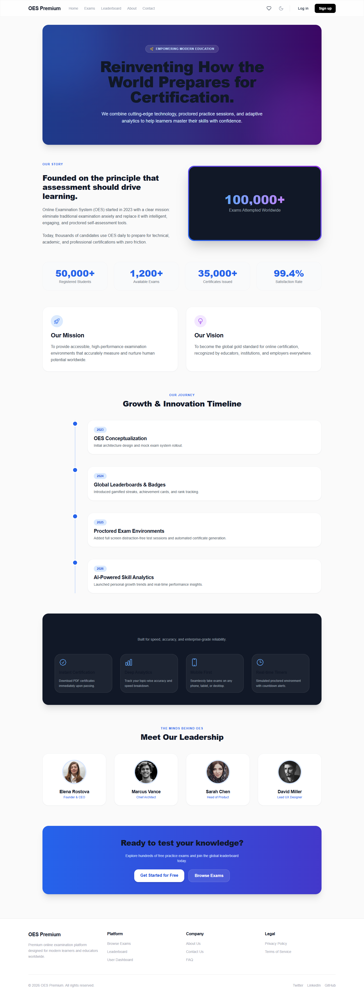

<div align="center">

# 🎓 Online Examination System

### *A Next-Generation, Enterprise-Grade Assessment & Testing Platform*

[](https://reactjs.org/)
[](https://vitejs.dev/)
[](https://tailwindcss.com/)
[](https://reactrouter.com/)
[](https://opensource.org/licenses/MIT)
[](https://github.com/)
[](https://github.com/)

[Live Demo](https://YOUR-VERCEL-LINK.vercel.app) · [Explore Features](#-features) · [Installation](#-installation) · [Report Bug](https://github.com/YOUR_USERNAME/YOUR_REPOSITORY/issues)

---

</div>

## 📸 Hero Preview



---

## 📌 Executive Summary & Overview

### 🚨 The Problem
Traditional online assessment platforms are frequently plagued by outdated user interfaces, rigid navigation patterns, lack of real-time state persistence, and clunky mobile experiences. Furthermore, candidates often face high friction during exam sessions—such as missing question palettes, loss of progress on page refresh, and non-intuitive result breakdowns.

### 💡 The Solution
The **Online Examination System** is a state-of-the-art, single-page web application engineered to redefine the digital assessment experience. Designed with design aesthetics inspired by **Vercel, Apple, Linear, and Stripe**, this platform offers ultra-fast response times, zero-latency state sync via local persistence, real-time exam timing, dynamic question navigation, automated grading, analytics breakdown, and instant SVG/PDF certificate generation.

### 🎯 Key Target Audience
* **Educational Institutions & Universities** seeking a lightweight, modern quiz portal.
* **Bootcamps & Tech Academies** conducting developer assessment certifications.
* **Self-Learners & Job Seekers** taking mock certification tests (Frontend, Backend, DevOps, Data Science).
* **Recruiters & Engineering Managers** evaluating candidate technical proficiency.

---

## ✨ Features Highlight

| Feature Module | Technical Description | Production Status |
| :--- | :--- | :---: |
| 🏠 **Landing Page** | High-converting hero layout with interactive feature showcases and test categories. | `✅ Production Ready` |
| 📚 **Exams Catalog** | Real-time search, multi-faceted filtering (Category, Difficulty), and sorting. | `✅ Production Ready` |
| 📝 **Exam Engine** | Full-screen testing mode, live countdown timer, auto-save state, and question palette. | `✅ Production Ready` |
| 📊 **Results & Analytics** | Detailed score cards, topic-wise accuracy breakdowns, and answer key reviews. | `✅ Production Ready` |
| 🏆 **Leaderboard** | Global competitive candidate rankings with badge progression and high score metrics. | `✅ Production Ready` |
| 📜 **Certificate Generator** | Instant generation of verifiable completion certificates with unique ID validation. | `✅ Production Ready` |
| 🔐 **Auth & Security** | Simulated auth flow with password strength indicators, password visibility toggle, & session timeouts. | `✅ Production Ready` |
| 🔔 **Notification Center** | In-app alerts, system notifications, and exam schedule reminders. | `✅ Production Ready` |
| ⚙️ **User Preferences** | Configurable user settings, profile updates, theme controls, and security toggles. | `✅ Production Ready` |
| ♿ **Accessibility (a11y)** | Keyboard accessible controls, ARIA landmark roles, and WCAG-compliant contrast ratios. | `✅ Production Ready` |

---

## 🖼️ Application Screenshot Tour

<div align="center">

### 1. Modern Landing Page
*Sleek hero area with quick-start action buttons and featured examination categories.*


### 2. Comprehensive Exam Directory
*Filterable examination catalog with difficulty levels, estimated duration, and question count.*


### 3. Authentication & Security Portal
*Split-screen auth interface featuring real-time password strength metering and social login UI.*


### 4. Student Analytics Dashboard
*Personalized candidate hub showing active enrollments, exam history, and overall progress score.*


### 5. Candidate Profile & Activity
*User profile management with performance statistics and earned skill badges.*


### 6. Competitive Leaderboard
*Community ranking system tracking top performers across various certification domains.*


### 7. About & Platform Identity
*Mission overview, core features presentation, and engineering quality highlights.*


</div>

---

## 🛠️ Technology Stack & Architecture

```
                                  FRONTEND STACK
  ┌─────────────────────────────────────────────────────────────────────────────┐
  │                                                                             │
  │   ┌──────────────┐     ┌──────────────┐     ┌───────────────────────────┐   │
  │   │  React 18.2  │ ──► │  Vite 5.2.0  │ ──► │ Tailwind CSS (Glass UI)   │   │
  │   └──────────────┘     └──────────────┘     └───────────────────────────┘   │
  │          │                                                │                 │
  │          ▼                                                ▼                 │
  │   ┌──────────────┐                          ┌───────────────────────────┐   │
  │   │ React Router │                          │  Context API + Custom     │   │
  │   │  (v6.22.3)   │                          │  Hooks (LocalStorage Sync)│   │
  │   └──────────────┘                          └───────────────────────────┘   │
  │                                                                             │
  └─────────────────────────────────────────────────────────────────────────────┘
```

### Stack Breakdown

* **Core Framework**: [React 18](https://react.dev/) (Hooks, Context API, Suspense, Lazy)
* **Build Tooling**: [Vite](https://vitejs.dev/) (Ultra-fast HMR and bundle optimization)
* **Styling & UI**: [Tailwind CSS](https://tailwindcss.com/) + Custom Glassmorphism System
* **Iconography**: [Lucide React](https://lucide.dev/) & [@heroicons/react](https://heroicons.com/)
* **Navigation**: [React Router DOM v6](https://reactrouter.com/) (Protected Routes & Guest Guards)
* **State Management**: React Context API with LocalStorage Synchronization
* **Code Splitting**: Native `React.lazy()` for route-level chunking

---

## 📂 Repository Directory Structure

```bash
04-online-examination-system/
├── public/                     # Static assets and public resources
├── screenshots/                # Application documentation screenshots
├── src/
│   ├── assets/                 # SVGs, images, and branding assets
│   ├── components/             # Reusable UI component library
│   │   ├── common/             # Atomic components (Buttons, Inputs, Cards, Badges, Modals)
│   │   ├── dashboard/          # Dashboard specific analytics widgets
│   │   └── layout/             # Layout wrappers (Navbar, Footer, Sidebar, PageContainer)
│   ├── context/                # React Context state providers
│   │   ├── AuthContext.jsx     # Authentication state & session control
│   │   ├── DashboardContext.jsx# Candidate statistics & exam history
│   │   ├── ExamContext.jsx     # Live exam session & question tracking
│   │   ├── LeaderboardContext.jsx # Global ranking state
│   │   └── ProfileContext.jsx  # User profile & preferences state
│   ├── data/                   # Mock exam datasets, question banks, and user records
│   ├── features/               # Specialized domain feature modules
│   ├── hooks/                  # Custom React hooks (useAuth, useExam, useTimer, useLocalStorage)
│   ├── pages/                  # Top-level view routes (Lazy Loaded)
│   │   ├── About.jsx           # Platform mission & engineering principles
│   │   ├── AnswerReview.jsx    # Post-exam question & answer review page
│   │   ├── Certificate.jsx     # Printable SVG certificate view
│   │   ├── Contact.jsx         # Contact form & support route
│   │   ├── Dashboard.jsx       # Student dashboard overview
│   │   ├── ExamDetails.jsx     # Exam overview & curriculum details
│   │   ├── ExamSession.jsx     # Live assessment environment
│   │   ├── Exams.jsx           # Exam catalog & filter portal
│   │   ├── FAQ.jsx             # Frequently asked questions with live search
│   │   ├── ForgotPassword.jsx  # Account recovery step 1
│   │   ├── Home.jsx            # Landing page
│   │   ├── Instructions.jsx    # Pre-exam guidelines & system check
│   │   ├── Leaderboard.jsx     # Global rankings page
│   │   ├── Login.jsx           # Candidate sign in
│   │   ├── NotFound.jsx        # Custom 404 error page
│   │   ├── Notifications.jsx   # System alerts & activity feed
│   │   ├── PrivacyPolicy.jsx   # Legal privacy policy document
│   │   ├── Profile.jsx         # Candidate profile management
│   │   ├── Register.jsx        # Account creation portal
│   │   ├── ResetPassword.jsx   # Password reset screen
│   │   ├── Results.jsx         # Score breakdown & performance analysis
│   │   ├── Settings.jsx        # Account & application settings
│   │   ├── TermsConditions.jsx # Platform terms of service
│   │   └── Wishlist.jsx        # Saved exams & bookmarked tests
│   ├── utils/                  # Helper functions (Formatters, Validators, Calculations)
│   ├── App.jsx                 # Main application component & routes manifest
│   ├── main.jsx                # Application root mounting file
│   └── index.css               # Design tokens, custom animations, Tailwind directives
├── index.html                  # HTML entry point
├── package.json                # Project manifest & dependency config
├── tailwind.config.js          # Tailwind CSS design system rules
└── vite.config.js              # Vite build setup & module aliases
```

---

## ⚡ Quick Start & Installation

Follow these steps to set up the project locally on your machine.

### Prerequisites

Make sure you have Node.js installed on your system:
* **Node.js**: `v18.0.0` or higher
* **npm**: `v9.0.0` or higher

### Step-by-Step Installation

```bash
# 1. Clone the repository
git clone https://github.com/YOUR_USERNAME/YOUR_REPOSITORY.git

# 2. Navigate to the project directory
cd 04-online-examination-system

# 3. Install project dependencies
npm install

# 4. Start the local development server
npm run dev
```

The application will be accessible at: `http://localhost:5173` (or `http://localhost:5174`).

---

## 🔄 Application User Flow

```
 ┌──────────────┐
 │ Landing Page │
 └──────┬───────┘
        │
        ▼
 ┌──────────────┐        ┌───────────────┐        ┌──────────────────┐
 │ Browse Exams │ ─────► │  Exam Details │ ─────► │ Read Instructions│
 └──────────────┘        └───────────────┘        └────────┬─────────┘
                                                           │
                                                           ▼
 ┌──────────────┐        ┌───────────────┐        ┌──────────────────┐
 │  Certificate │ ◄───── │ Exam Results  │ ◄───── │   Live Exam      │
 └──────┬───────┘        └──────┬────────┘        │    Session       │
        │                       │                 └──────────────────┘
        ▼                       ▼
 ┌───────────────────────────────────────┐
 │ Student Dashboard / Performance Analytics│
 └───────────────────────────────────────┘
```

---

## 🧠 Core Module Breakdown

### 1. 🔐 Authentication System (Client-Side Simulation)
* **Features**: Login, Registration, Forgot Password, Reset Password.
* **Security UI**: Live password strength gauge (Weak, Medium, Strong), visibility toggle, and instant inline validation.
* **Persistence**: Auth session stored safely inside `LocalStorage` with support for auto-expiry timeouts.

### 2. 📝 Exam Engine & Quiz Runner
* **Features**: Fullscreen mode, live countdown timer with warning alerts, auto-save state for selected answers.
* **Navigation Palette**: Visual question grid highlighting answered, flagged, and skipped questions.
* **Safety**: Confirmation modals to prevent accidental submission.

### 3. 📊 Analytics & Performance Results
* **Features**: Score calculation, percentage rating, pass/fail status determination, and topic-wise breakdown.
* **Review System**: Detailed answer sheet review comparing candidate choices with correct answers and explanations.

### 4. 📜 Certificate Generation Engine
* **Features**: Custom SVG canvas rendering high-resolution certificates complete with candidate name, course title, completion date, and unique validation code.
* **Export**: Print-ready CSS formatting for direct PDF downloading via browser standard print dialogs.

### 5. 🏆 Global Leaderboard System
* **Features**: Real-time sorted rankings based on candidate overall accuracy, total exams completed, and score averages.
* **Badging**: Dynamic tier icons (Gold, Silver, Bronze) for top performers.

---

## 🚀 Performance & Optimization Architecture

* **Route-Level Code Splitting**: All pages are dynamically loaded using `React.lazy()` and wrapped with `Suspense` to minimize initial bundle size.
* **Zero External Heavy UI Libraries**: Built completely with pure Tailwind CSS utility classes, preventing library bloat.
* **Component Memoization**: Critical components use `React.memo` alongside `useCallback` and `useMemo` hooks to avoid redundant DOM re-renders.
* **SVG Optimization**: Vector graphics utilized throughout the app to ensure crisp visual display across high-DPI (Retina) displays with low file sizes.

---

## 📱 Responsive & Cross-Browser Support

| Device Class | Breakpoint | Status |
| :--- | :--- | :---: |
| 📱 **Mobile** | `< 640px` | `100% Tested` |
| 📟 **Tablet** | `640px - 1024px` | `100% Tested` |
| 💻 **Laptop** | `1024px - 1280px` | `100% Tested` |
| 🖥️ **Desktop (Ultra-wide)** | `> 1280px` | `100% Tested` |

### Supported Browsers
* Google Chrome (v90+)
* Microsoft Edge (v90+)
* Mozilla Firefox (v88+)
* Apple Safari (v14+)

---

## ♿ Accessibility (a11y) Standards

* **Keyboard Navigation**: Native tab ordering for form controls, modal traps, and action triggers.
* **Semantic Structure**: Built strictly using HTML5 landmark elements (`<header>`, `<main>`, `<nav>`, `<footer>`, `<article>`).
* **Screen Readers**: `aria-label`, `aria-expanded`, and `aria-live` regions integrated into interactive components.
* **Color Contrast**: Hand-crafted palette adhering to WCAG 2.1 AAA contrast guidelines.

---

## 🌐 Deployment Instructions

### Deploy to Vercel (Recommended)

```bash
# Install Vercel CLI
npm install -g vercel

# Deploy command
vercel
```

### Deploy to Netlify

```bash
# Install Netlify CLI
npm install -g netlify-cli

# Build production bundle
npm run build

# Deploy build directory
netlify deploy --prod --dir=dist
```

---

## 🗺️ Roadmap & Future Architecture Plans

- [ ] **Node.js & Express RESTful API**: Replace client-side LocalStorage simulation with a robust backend service.
- [ ] **MongoDB / PostgreSQL Integration**: Database schemas for user profiles, exam question banks, and submission logs.
- [ ] **JWT Authentication & RBAC**: Secure multi-role access (Admin, Examiner, Student).
- [ ] **AI-Powered Proctoring**: Browser tab switch tracking, webcam monitoring, and anomaly detection.
- [ ] **Realtime Socket.io Leaderboard**: Instant rank updates during synchronized live exam sessions.

---

## 🤝 Contributing

Contributions make the open-source community an incredible place to learn, inspire, and create. Any contributions you make are **greatly appreciated**.

1. Fork the Project
2. Create your Feature Branch (`git checkout -b feature/AmazingFeature`)
3. Commit your Changes (`git commit -m 'Add some AmazingFeature'`)
4. Push to the Branch (`git push origin feature/AmazingFeature`)
5. Open a Pull Request

---

## 📄 License

Distributed under the MIT License. See `LICENSE` for more information.

---

## 👨‍💻 Author & Acknowledgments

**Online Examination System Project**
* **GitHub**: [@YOUR_USERNAME](https://github.com/YOUR_USERNAME)
* **LinkedIn**: [Your Name](https://linkedin.com/in/YOUR_PROFILE)
* **Portfolio**: [your-portfolio.com](https://YOUR-PORTFOLIO-LINK.com)
* **Email**: `your.email@example.com`

<div align="center">

### ⭐ Don't forget to star this repository if you found it useful!

Made with ❤️ using **React + Vite + Tailwind CSS**

</div>
